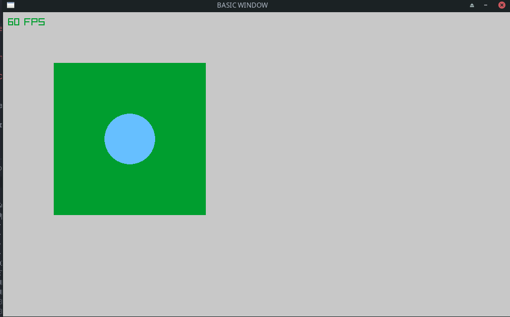

# Raylib basic example

## How to use
You just have to clone or download the repository and run:
```bash
make run
```

## Demonstration



## Installation

### Dependencies

#### Ubuntu - Debian based
```bash
sudo apt install libasound2-dev mesa-common-dev libx11-dev libxrandr-dev libxi-dev xorg-dev libgl1-mesa-dev libglu1-mesa-dev
```

#### Fedora - Redhat based
```bash
sudo apt install libasound2-dev mesa-common-dev libx11-dev libxrandr-dev libxi-dev xorg-dev libgl1-mesa-dev libglu1-mesa-dev
```

#### Manjaro - Arch based
Dependencies should be installed by default.

### Library
```bash
# DOWNLOAD THE LIB
git clone https://github.com/raysan5/raylib.git raylib
cd raylib/src/

# COMPILE IT
make PLATFORM=PLATFORM_DESKTOP RAYLIB_LIBTYPE=SHARED

# INSTALL IT ON YOUR SYSTEM
sudo make install RAYLIB_LIBTYPE=SHARED
```


