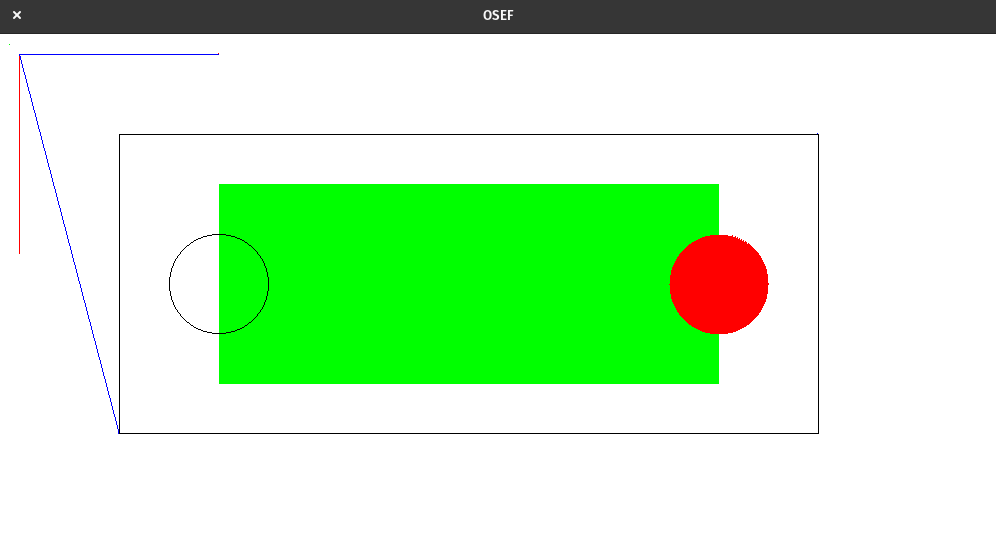

# SDL Basics

This is a simple example project that you can use to initialize and run your first SDL project easily.

## How to use
You just have to clone or download the repository and run:
```bash
make run
```

## Demonstration


## Installation
### Ubuntu / Debian based
```bash
sudo apt-get install libsdl2-2.0
sudo apt-get install libsdl2-dev
```

### Manjaro - Arch
Everything should already be installed.

